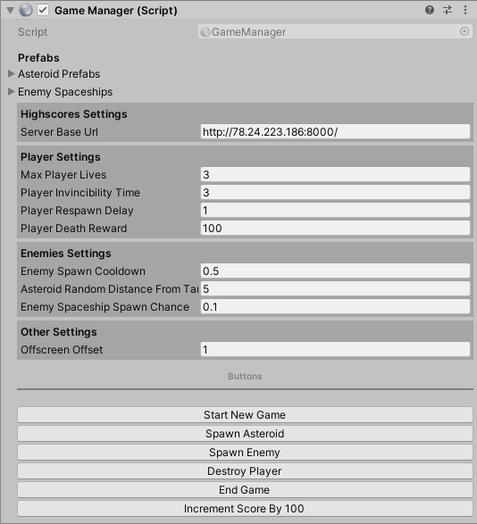

# Сопроводительная документация

Что есть на текущий момент:
- Управление кораблем игрока
- Стрельба и уничтожение объектов
- Спавн врагов за пределами экрана
- Враг: Астероид (3 вида)
- Враг: Корабль
- Эффекты взрыва, разрушения корабля
- Система очков
- Система глобальных рекордов, с записью на сервер никнейма, сообщения и рекорда игрока
- Backend системы рекордов с Rest API
- Анимированный интерфейс
- Шаблон для WebGL
- Радость и веселье

# Описание проекта

### Структура

Главная и единственная сцена находится в `Assets/MainScene.unity`

`Animations/` - Различные анимации

`Fonts/` - Шрифты

`Prefabs/` - Различные префабы

`Scripts/` - Скрипты

`Shaders/` - Шейдеры

`Sprites/` - Спрайты

`WebGLTemplates/` - шаблоны для WebGL

`_ThirdParty/` - сторонние ассеты

### Скрипты

**Основные:**

`GameManager.cs` - содержит поля с настройками баланса игры, такие как время между спавном врагов, шансов на появление вражеского корабля и т.д.
Также является скриптом, отвечающим за главную логику игры

`SpaceshipController.cs` - содержит настройки и логику управления кораблем игрока

`UIController.cs` - класс для управления всем UI в игре

`HighscoresManager.cs` - содержит логику управления рекордами игрока

`Entity.cs` - класс, от которого наследуются все элементы игры - враги, снаряды, игрок

**Общее описание папок со скриптами:**

`UI/` - скрипты для UI

`Highscores/` - скрипты для управления рекордами игрока

`Effects/` - скрипты для эффектов (взрыв, смерть игрока)

`Spaceship/` - скрипты для корабля игрока

`Enemies/` - скрипты, отвечающие за логику врагов

`Utils/` - утилитарные скрипты и расширения
